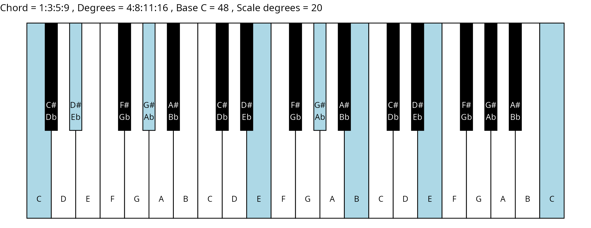
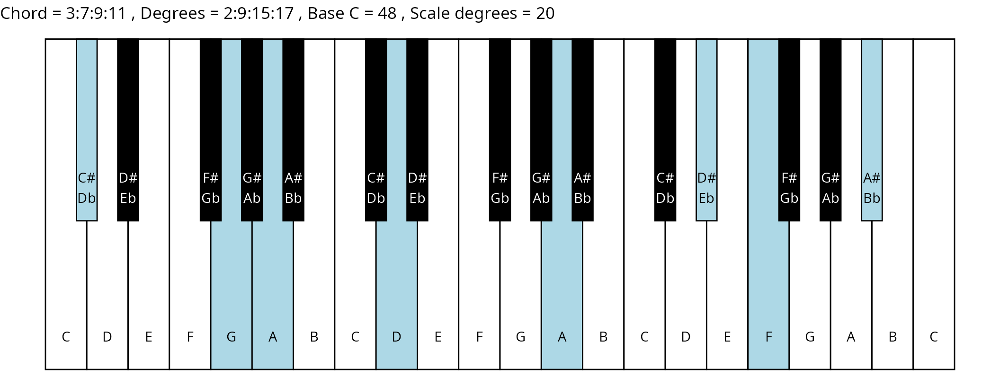

# Tetrads of the 1-3-5-7-9-11 Eikosany on a 37-key Synthesizer

``` r
library(eikosany)
```

## The scale table

``` r
scale <- cps_scale_table(root_divisor = 33) # 1-3-5-7-9-11 Eikosany default
print(scale)
#>     note_name    ratio ratio_frac ratio_cents interval_cents degree
#>        <char>    <num> <charFrac>       <num>          <num>  <num>
#>  1:    1x3x11 1.000000          1     0.00000             NA      0
#>  2:     3x5x9 1.022727      45/44    38.90577       38.90577      1
#>  3:     1x5x7 1.060606      35/33   101.86668       62.96090      2
#>  4:    3x9x11 1.125000        9/8   203.91000      102.04332      3
#>  5:    1x7x11 1.166667        7/6   266.87091       62.96090      4
#>  6:     5x7x9 1.193182     105/88   305.77668       38.90577      5
#>  7:    3x5x11 1.250000        5/4   386.31371       80.53704      6
#>  8:     1x3x7 1.272727      14/11   417.50796       31.19425      7
#>  9:    7x9x11 1.312500      21/16   470.78091       53.27294      8
#> 10:     1x5x9 1.363636      15/11   536.95077       66.16987      9
#> 11:     3x7x9 1.431818      63/44   621.41797       84.46719     10
#> 12:    5x7x11 1.458333      35/24   653.18462       31.76665     11
#> 13:    1x9x11 1.500000        3/2   701.95500       48.77038     12
#> 14:     3x5x7 1.590909      35/22   803.82168      101.86668     13
#> 15:     1x3x9 1.636364      18/11   852.59206       48.77038     14
#> 16:    1x5x11 1.666667        5/3   884.35871       31.76665     15
#> 17:    3x7x11 1.750000        7/4   968.82591       84.46719     16
#> 18:     1x3x5 1.818182      20/11  1034.99577       66.16987     17
#> 19:    5x9x11 1.875000       15/8  1088.26871       53.27294     18
#> 20:     1x7x9 1.909091      21/11  1119.46296       31.19425     19
#> 21:   1x3x11' 2.000000          2  1200.00000       80.53704     20
#>     note_name    ratio ratio_frac ratio_cents interval_cents degree
#>        <char>    <num> <charFrac>       <num>          <num>  <num>
```

## The keyboard map

``` r
map <- keyboard_map(scale)
print(map)
#> Key: <note_number>
#>      note_number name_12edo octave_12edo note_name ratio_frac degree
#>            <num>     <char>        <num>    <char>     <char>  <num>
#>   1:           0          C           -1    1x3x11          1      0
#>   2:           1         C#           -1     3x5x9      45/44      1
#>   3:           2          D           -1     1x5x7      35/33      2
#>   4:           3         D#           -1    3x9x11        9/8      3
#>   5:           4          E           -1    1x7x11        7/6      4
#>  ---                                                                
#> 124:         123         D#            9    3x9x11        9/8      3
#> 125:         124          E            9    1x7x11        7/6      4
#> 126:         125          F            9     5x7x9     105/88      5
#> 127:         126         F#            9    3x5x11        5/4      6
#> 128:         127          G            9     1x3x7      14/11      7
#>      period_number       freq     cents ref_keyname ref_octave ref_offset
#>              <num>      <num>     <num>      <char>      <num>      <num>
#>   1:            -3   32.70320  2400.000           C          2          0
#>   2:            -3   33.44645  2438.906           C          2         39
#>   3:            -3   34.68521  2501.867          C#          2          2
#>   4:            -3   36.79110  2603.910           D          2          4
#>   5:            -3   38.15373  2666.871          D#          2        -33
#>  ---                                                                     
#> 124:             3 2354.63009  9803.910           D          8          4
#> 125:             3 2441.83861  9866.871          D#          8        -33
#> 126:             3 2497.33494  9905.777          D#          8          6
#> 127:             3 2616.25565  9986.314           E          8        -14
#> 128:             3 2663.82394 10017.508           E          8         18
```

## The chord table

``` r
chords <- cps_chord_table(scale)
print(chords)
#> Key: <chord_index, is_subharm>
#>            chord    degrees chord_index is_subharm
#>           <char>     <char>       <int>      <num>
#>  1:      1:3:5:7  3:8:12:18           1          0
#>  2:  /1:/3:/5:/7  2:7:13:17           1          1
#>  3:      1:3:5:9  4:8:11:16           2          0
#>  4:  /1:/3:/5:/9  1:9:14:17           2          1
#>  5:     1:3:5:11  5:8:10:19           3          0
#>  6: /1:/3:/5:/11  0:6:15:17           3          1
#>  7:      1:3:7:9 6:11:15:18           4          0
#>  8:  /1:/3:/7:/9 7:10:14:19           4          1
#>  9:     1:3:7:11   1:5:9:18           5          0
#> 10: /1:/3:/7:/11   0:4:7:16           5          1
#> 11:     1:3:9:11  2:5:11:13           6          0
#> 12: /1:/3:/9:/11  0:3:12:14           6          1
#> 13:      1:5:7:9   0:3:6:16           7          0
#> 14:  /1:/5:/7:/9   2:5:9:19           7          1
#> 15:     1:5:7:11  1:3:10:14           8          0
#> 16: /1:/5:/7:/11  2:4:11:15           8          1
#> 17:     1:5:9:11 7:10:13:16           9          0
#> 18: /1:/5:/9:/11 9:12:15:18           9          1
#> 19:     1:7:9:11  1:6:13:17          10          0
#> 20: /1:/7:/9:/11  4:8:12:19          10          1
#> 21:      3:5:7:9  0:4:12:15          11          0
#> 22:  /3:/5:/7:/9  1:5:10:13          11          1
#> 23:     3:5:7:11 9:12:14:19          12          0
#> 24: /3:/5:/7:/11 6:11:13:16          12          1
#> 25:     3:5:9:11   2:4:7:19          13          0
#> 26: /3:/5:/9:/11   1:3:6:18          13          1
#> 27:     3:7:9:11  2:9:15:17          14          0
#> 28: /3:/7:/9:/11  3:8:10:16          14          1
#> 29:     5:7:9:11  0:7:14:17          15          0
#> 30: /5:/7:/9:/11  5:8:11:18          15          1
#>            chord    degrees chord_index is_subharm
#>           <char>     <char>       <int>      <num>
```

## The plots

``` r
scale_degrees <- length(scale$degree) - 1
base_note_number = 48
chord_names <- chords$chord
degrees <- chords$degrees
degrees_matrix <- matrix(
  unlist(lapply(strsplit(degrees, ":"), as.numeric)),
  byrow = TRUE,
  nrow = length(degrees)
)

for (ichord in 1:nrow(degrees_matrix)) {
  chord_vector <- degrees_matrix[ichord, ]
  title_string <- paste(
    "Chord =",
    chord_names[ichord],
    ", Degrees =",
    degrees[ichord],
    ", Base C =",
    base_note_number,
    ", Scale degrees =",
    scale_degrees,
    sep = " "
  )
  piano_plot <- chord_plot(
    chord_vector, title_string, map, base_note_number
  )
  print(piano_plot)
}
```


